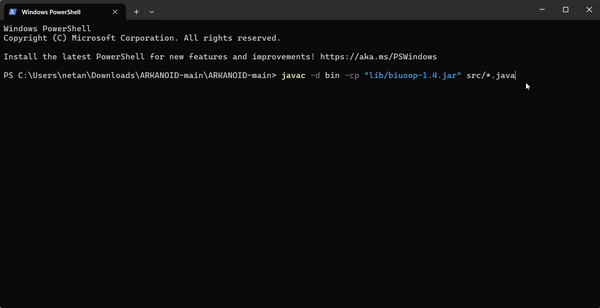

# ARKANOID Project

This project is an implementation of the classic Arkanoid game in Java.

## Introduction

As part of the OOP course, we were tasked with implementing a version of the old and familiar Arkanoid game. The game includes multiple stages with increasing difficulty levels and varied backgrounds. It is implemented in Java using OOP principles, incorporating features such as:

- Polymorphism and inheritance
- Familiarity with basic design patterns like the Observer pattern
- Use of Java collections and data structures
- Creation of game levels with different difficulties
- Adherence to the open/closed principle
- Working with GUI components


## How to Run the Project


1. **Navigate to the Project Directory:**

    ```sh
    cd path/to/ArkanoidGameP4
    ```

2. **Compile the Java Files:**

    ```sh
    javac -d bin -cp "lib/biuoop-1.4.jar" src/*.java
    ```

3. **Create the JAR File:**

    ```sh
    jar cfm bin/ArkanoidGameP4.jar src/MANIFEST.MF -C bin .
    ```

4. **Run the JAR File with Classpath:**

    ```sh
    java -cp "bin/ArkanoidGameP4.jar;lib/biuoop-1.4.jar" Ass6Game
    ```


## Dependencies

- **biuoop-1.4.jar**: A required library for the GUI components.

## Author

Nathaniel Sade
