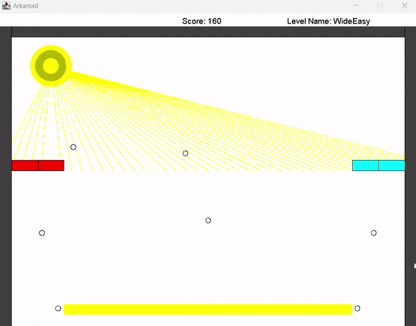

# ARKANOID Project

This project is an implementation of the classic Arkanoid game in Java.

## Introduction

As part of the OOP course, we were tasked with implementing a version of the old and familiar Arkanoid game. The game includes multiple stages with increasing difficulty levels and varied backgrounds. It is implemented in Java using OOP principles, incorporating features such as:

- Polymorphism and inheritance
- Familiarity with basic design patterns like the Observer pattern
- Use of Java collections and data structures
- Creation of game levels with different difficulties
- Adherence to the open/closed principle
- Working with GUI components



<details>
<summary><b>How to Run the Project</b></summary>

1. **clone the project:**

    ```sh
    git clone https://github.com/nathanielsade/ARKANOID.git C:\Users\netan\ARKANOID
    ```

2. **Navigate to the Project Directory:**

    ```sh
    cd path/to/ARKANOID
    ```

3. **Compile the Java Files:**

    ```sh
    javac -d bin -cp "lib/biuoop-1.4.jar" src/*.java
    ```

4. **Create the JAR File:**

    ```sh
    jar cfm bin/ArkanoidGameP4.jar src/MANIFEST.MF -C bin .
    ```

5. **Run the JAR File with Classpath:**

    ```sh
    java -cp "bin/ArkanoidGameP4.jar;lib/biuoop-1.4.jar" Ass6Game
    ```

</details>
<details>
<summary><b>Description of Classes</b></summary>

- **Ass6Game.java**: Entry point of the application, responsible for running the game.
- **Animation.java**: Interface representing a single animation.
- **AnimationRunner.java**: Responsible for running animations in a GUI.
- **Ball.java**: Represents a 2D ball object with position, radius, color, and velocity.
- **BallRemover.java**: Listens for hit events to remove balls from the game and update the ball counter.
- **Block.java**: Represents a block in 2D space.
- **BlockRemover.java**: Listens for hit events to remove blocks from the game and update the block counter.
- **CityBackground.java**: Represents the city background in a game.
- **Collidable.java**: Interface representing an object that can be collided with.
- **CollisionInfo.java**: Represents information about a collision.
- **CountdownAnimation.java**: Represents an animation that displays a countdown on the screen.
- **Counter.java**: A simple counter that can be incremented or decremented.
- **DayBackground.java**: Represents the day background in a game.
- **DirectHit.java**: Represents the "Direct Hit" level in a game.
- **GameEnvironment.java**: Manages a collection of Collidable objects and provides methods for adding new objects and checking for collisions.
- **GameFlow.java**: Handles the flow of the game, including running multiple levels and handling the final outcome.
- **GameLevel.java**: Represents a level in a simple game, containing sprites and a game environment.
- **GameOver.java**: Represents an animation displayed when the player lost the game.
- **Green3.java**: Represents the "Green 3" level in a game.
- **HitListener.java**: Interface for objects that listen for hit events.
- **HitNotifier.java**: Interface for objects that can notify HitListeners about hit events.
- **KeyPressStoppableAnimation.java**: Represents an animation that can be stopped by a key press.
- **LevelInformation.java**: Represents information about a game level.
- **Line.java**: Represents a line in a 2D coordinate system.
- **NightBackground.java**: Represents the night background in a game.
- **Paddle.java**: Represents the player-controlled paddle in the game.
- **PauseScreen.java**: Represents a screen displayed when the game is paused.
- **Point.java**: Represents a point in a 2D coordinate system.
- **Rectangle.java**: Represents a rectangle in 2D space.
- **ScoreIndicator.java**: Displays the current score in the game.
- **ScoreTrackingListener.java**: Listens for hit events to update the score.
- **Sprite.java**: Interface representing an object in the game.
- **SpriteCollection.java**: A collection of sprites that can be drawn on and updated.
- **Velocity.java**: Specifies the change in position on the x and y axes.
- **WideEasy.java**: Represents the "Wide Easy" level in a game.
- **YouWin.java**: Represents an animation displayed when the player wins the game.

</details>
## Dependencies

- **biuoop-1.4.jar**: A required library for the GUI components.

## Author

Nathaniel Sade
